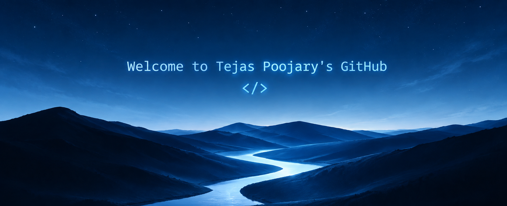

  

&nbsp;

&nbsp;

---

# ⚙️ Technologies

<table>
<tr>
<td width="43%" align="center" valign="middle">

</td>
<td width="57%" valign="middle">

Hello! My name is **Tejas Poojary**, and I am a **VLSI Engineering student**.

I am passionate about **designing digital systems & embedded hardware**, building **intelligent robots & IoT systems**, exploring **AI/ML and Edge Intelligence**, and turning ideas into real-world systems.

💻 I code with **Verilog, Python & C/C++**.

🔧 I enjoy turning **ideas → prototypes → working systems**.

 

> **Learn. Build. Break. Improve. Repeat.**

</td>
</tr>
</table>

---

# 🎯 Hobbies & Goals

**🎓 VLSI Engineering** • **⚡ Embedded Systems** • **🧠 AI/ML** • **🤖 Robotics**

 

> *“Learn. Build. Break. Improve. Repeat.”*

 

### ⚡ Hardware × AI × Code = Possibilities

---

